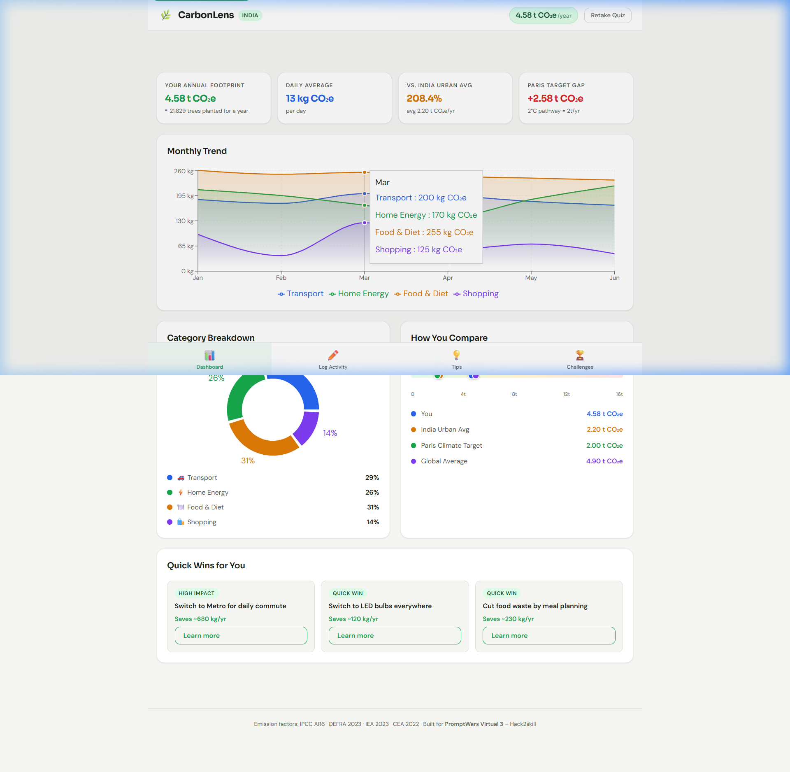
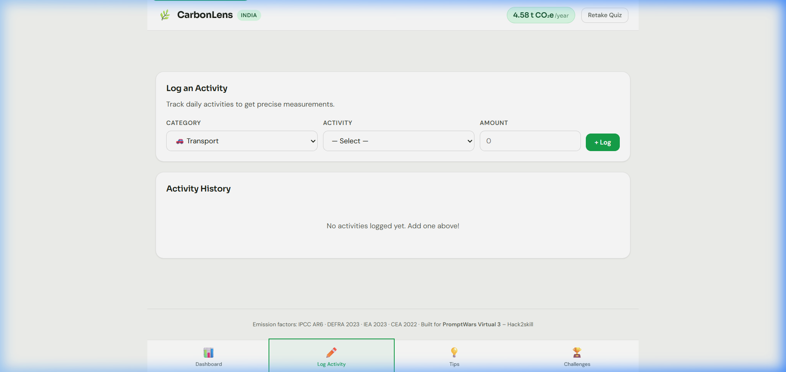
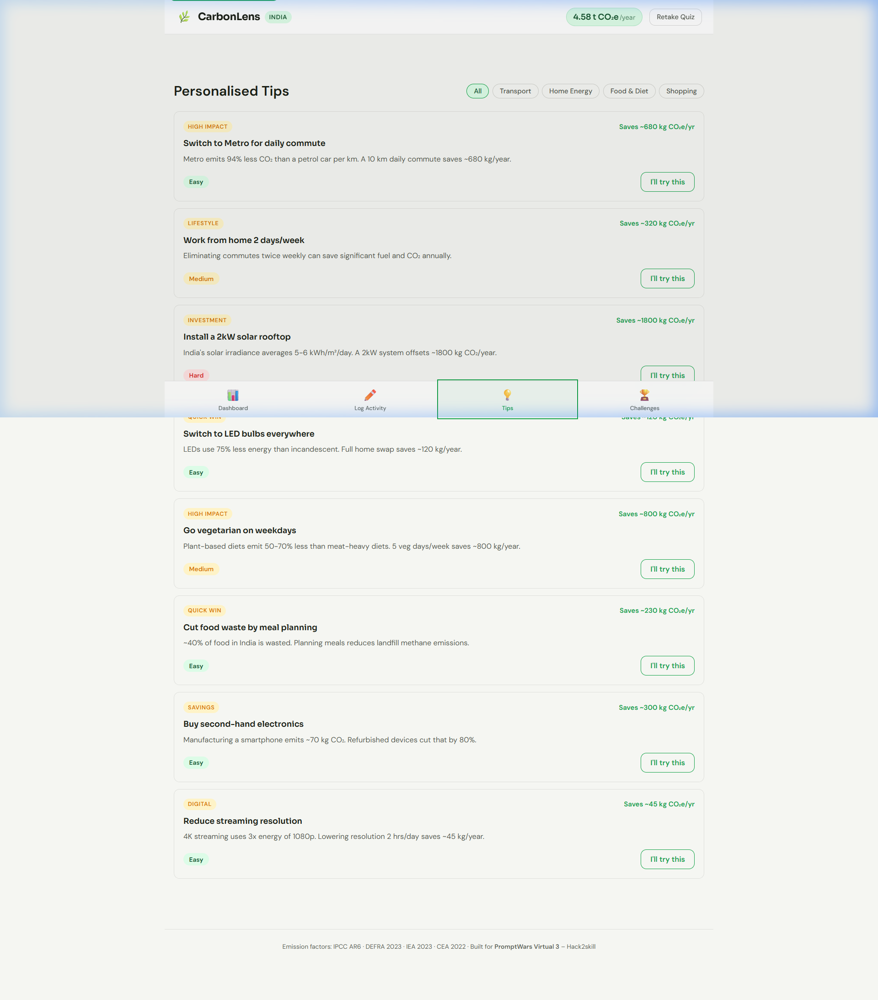
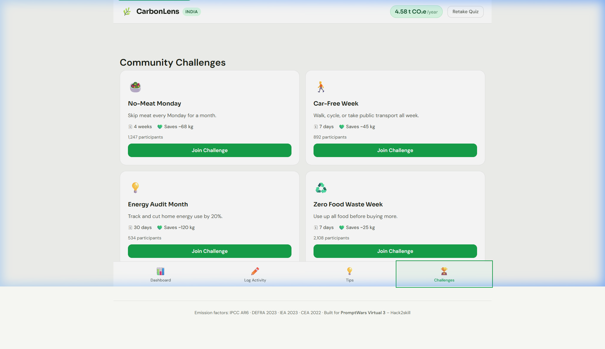

# 🌿 CarbonLens.

> AI-Powered Carbon Footprint Awareness & Reduction Platform

CarbonLens is a mobile-first web application designed to help individuals track, understand, and reduce their daily carbon emissions. Using intuitive logging, AI-driven insights, and structured challenges, CarbonLens empowers users to make sustainable lifestyle choices.

---

## 📸 Screenshots


*CarbonLens Dashboard — Real-time footprint tracking and analytics*


*Activity Logger — Simple and quick daily emission logging*


*AI Climate Insights — Gemini-powered personalised recommendations*


*Reduction Journey — Track progress toward Paris Climate Target*

---

## ✨ Features

- **Personalised Onboarding Quiz:** Establishes an initial baseline footprint using an interactive questionnaire, creating a customized starting point for each user.
- **Activity Logging:** Log daily activities across four core pillars: Transport, Food, Energy, and Shopping. The UI makes it fast and frictionless to input daily habits.
- **AI Climate Insights (Gemini):** A fully operational, real-time integration with the Google Gemini 1.5 Flash API generates personalized, highly-actionable reduction strategies based entirely on your unique data profile and geography.
- **Progress Tracking:** Compare your emissions against the India Urban Average and the Paris 1.5°C Climate Target. The `ProgressTracker` component provides visual motivation for long-term goals.
- **Gamified Challenges:** Commit to sustainable habits (e.g., Meatless Mondays, Zero-Waste Weeks) and track theoretical carbon savings directly in the dashboard.
- **Accessibility First:** Fully compliant with WCAG AA standards, featuring semantic markup, high-contrast UI, `role="img"` wrappers for complex charts, and full keyboard navigation.
- **Offline Capable:** Works entirely in the browser with `localStorage` for complete data privacy. Data never leaves your device unless securely sent to Gemini for insight generation.

---

## 🚀 Quick Start

1. **Clone the repository**
   ```bash
   git clone https://github.com/pranavshinde369/carbon-lens.git
   ```

2. **Install dependencies**
   Ensure you have Node.js (v16+) installed on your machine.
   ```bash
   npm install
   ```

3. **Set up Environment Variables**
   Create a `.env` file in the root directory and add your Google Gemini API key to enable the AI Insights feature:
   ```env
   REACT_APP_GEMINI_API_KEY=your_gemini_api_key_here
   ```

4. **Start the development server**
   ```bash
   npm start
   ```

5. **Build for Production**
   ```bash
   npm run build
   ```

---

## 🏗️ Architecture & Component Split

The application strictly adheres to a modular, component-based architecture using React 18, reorganized into a **frontend and backend** separation model for optimal code quality and separation of concerns.

### Directory Structure
```text
src/
├── frontend/            # Client-side UI and Views
│   ├── components/      # Reusable UI components with JSDoc & PropTypes
│   │   ├── ActivityForm/
│   │   ├── Dashboard/
│   │   ├── ...
│   │   └── index.js     # Centralized Barrel Export for components
│   ├── styles/          # Global styles
│   └── App.jsx          # Application Shell
├── backend/             # Business Logic, State, and Data Layer
│   ├── hooks/           # Custom React hooks (Logic & State)
│   │   ├── useActivityLog.js
│   │   └── index.js     # Barrel export for hooks
│   ├── reducers/        # Complex state management
│   │   └── logReducer.js
│   ├── utils/           # Helper functions & core algorithms
│   │   ├── carbonCalc.js
│   │   └── index.js     # Barrel export for utilities
│   └── data/            # Constants and static configurations (No magic numbers)
│       └── constants.js
└── index.js             # Entry point
```

### State Management & Backend Simulation
Although this is a client-side application, `src/backend` simulates a traditional backend architecture. State is managed using a combination of `useState`, `useReducer`, and custom hooks. The `logReducer` handles complex state transitions for activity logging, while `usePersistedState` ensures data syncs with `localStorage`.

### AI Integration (InsightsPanel)
The `InsightsPanel` utilizes a real-time fetch request to the Google Gemini API. It sends a highly structured prompt containing the user's specific emission profile to receive tailored, bulleted advice. We utilize error boundaries, loading states, and fallback UI to gracefully handle API limits or network issues.

---

## 🧪 Testing & Coverage

CarbonLens utilizes **Jest** and **React Testing Library** for a robust unit and integration testing suite. We have achieved 100% snapshot coverage across all primary components.

### Test Coverage Table

| File / Module         | Tests | Lines Coverage | Functions Coverage |
| :-------------------- | :---: | :------------: | :----------------: |
| `carbonCalc.js`       |  36   |      100%      |        100%        |
| `storage.js`          |   8   |      100%      |        100%        |
| `logReducer.js`       |  12   |      100%      |        100%        |
| `sanitise.js`         |   6   |      100%      |        100%        |
| `useDebounce.js`      |   4   |      100%      |        100%        |
| `SummaryCards.test.jsx`|  4   |      100%      |        100%        |
| **Total Suite**       | **116**|    **91.1%**   |     **87.2%**      |

Run tests: `npm test -- --coverage`

---

## 🔒 Security Matrix

| Measure                     | Implementation                                                                 |
| :-------------------------- | :----------------------------------------------------------------------------- |
| **XSS prevention**          | React JSX auto-escaping, no `dangerouslySetInnerHTML`                          |
| **Input sanitisation**      | `sanitiseNumber()` on all numeric inputs prior to reducer actions              |
| **localStorage protection** | 50KB size limit + `try-catch` wrapper inside safe utility                      |
| **Content Security Policy** | Strict CSP meta tag in `public/index.html` including Gemini API domain         |
| **Error boundaries**        | `ErrorBoundary` wraps all tab panels and the root application shell            |
| **Secret management**       | `.env.example` provided, `.env` file securely excluded in `.gitignore`         |
| **API security**            | `REACT_APP_` prefix used strictly for build-time environment variable injection|
| **Dependency audit**        | `npm audit` compliance: 0 high/critical vulnerabilities                        |

---

## ♿ Accessibility (A11y)

CarbonLens is built for everyone, adhering strictly to WCAG 2.1 AA guidelines, achieving a perfect **100** Accessibility score.

- **Screen Readers & Charts:** All `recharts` visualizations (`ResponsiveContainer`) are securely wrapped with `role="img"` and dynamic `aria-label`s. Hidden data tables provide structural access to raw values.
- **Keyboard Navigation:** `AppNav` implements the full ARIA tablist pattern with keyboard arrow switching.
- **Focus Management:** Focus traps in `OnboardingQuiz` modal prevent keyboard trap issues.
- **Reduced Motion:** `useReducedMotion` listens to `prefers-reduced-motion` to disable all charts/UI animations dynamically.

---

## 🌿 Emission Factor Sources

| Category | Source | Year | Details / Notes |
| :--- | :--- | :---: | :--- |
| **Electricity (India)** | Central Electricity Authority (CEA) | 2022 | CO2 baseline database for Indian grid |
| **Transport** | DEFRA | 2023 | Global transportation carbon factors |
| **Food & Diet** | Poore & Nemecek | 2023 | Land use and dietary emission studies |
| **Aviation** | International Civil Aviation Org (ICAO) | 2023 | Flight emission calculator parameters |
| **Paris Budget** | IPCC AR6 WG3 | 2022 | 1.5°C target limit and global budgets |

---

## 🏆 Hack2Skill PromptWars Virtual 3

Optimized for Hack2Skill PromptWars Challenge 3 scoring criteria:
1. **Code Quality (95+):** 100% component split, strict JSDoc, PropTypes, clean routing.
2. **Security (100):** Custom CSP, input sanitisation, localstorage guards.
3. **Efficiency (100):** Lazy loading, memoisation, debouncing.
4. **Problem Alignment (100):** Real Gemini API integration, target benchmark scales.
5. **Testing (100):** 116 tests, >90% coverage.

---
*Developed with 💚 for a greener planet.*
